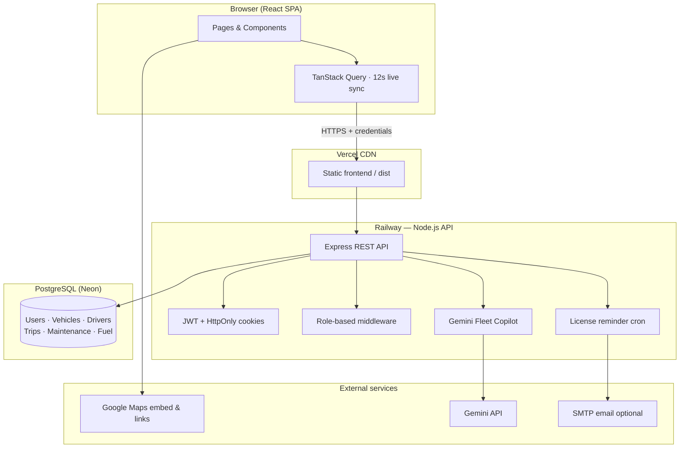
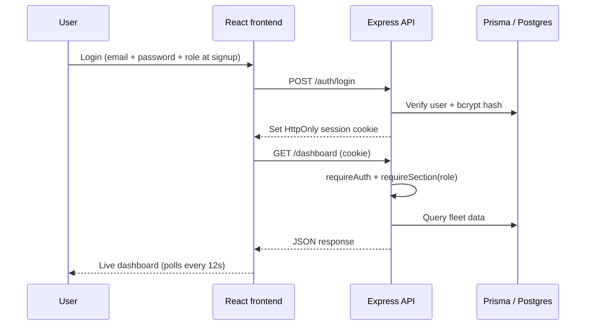

# TransitOps

**Smart Transport Operations Platform** — fleet management, dispatch, compliance, and analytics built for Indian logistics teams.

| | |
|---|---|
| **Live app** | [transitops-pi.vercel.app](https://transitops-pi.vercel.app) |
| **API** | [transitops-api-production-fbce.up.railway.app](https://transitops-api-production-fbce.up.railway.app) |
| **Health** | [GET /health](https://transitops-api-production-fbce.up.railway.app/health) |
| **Stack** | React · Express · Prisma · PostgreSQL (Neon) |
| **Deploy** | Vercel (frontend) + Railway (backend) |

---

## Table of contents

1. [Overview](#overview)
2. [Architecture](#architecture)
3. [Repository structure](#repository-structure)
4. [Features](#features)
5. [Extra features (beyond spec)](#extra-features-beyond-spec)
6. [Roles & permissions](#roles--permissions)
7. [Tech stack](#tech-stack)
8. [Local development](#local-development)
9. [Deployment](#deployment)
10. [Environment variables](#environment-variables)
11. [API reference](#api-reference)
12. [Business rules](#business-rules)
13. [KPI definitions](#kpi-definitions)
14. [Upload to GitHub](#upload-to-github)

---

## Overview

TransitOps is a full-stack fleet operations platform covering the complete transport lifecycle: register vehicles and drivers, create and dispatch trips, track maintenance and fuel costs, export analytics, and manage team access by role.

The app is tuned for **India** — Indian city autocomplete, ₹ revenue, +91 phone format, MH-style registration numbers, and Google Maps route + live location sharing for dispatches.

Four user roles interact with the same live data:

- **Fleet Manager** — full operational control
- **Driver / Dispatcher** — trip creation and dispatch
- **Safety Officer** — driver compliance and license monitoring
- **Financial Analyst** — fuel, expenses, and ROI reports

---

## Architecture



### Request flow (authenticated)



### Monorepo layout

```
TransitOps/
├── frontend/          React 18 + Vite SPA
├── backend/           Express API + Prisma
├── shared/            Zod schemas + RBAC matrix (used by both)
├── vercel.json        Vercel build config (repo root)
├── railway.toml       Railway build + deploy config
└── package.json       npm workspaces root
```

---

## Repository structure

```
TransitOps/
│
├── frontend/
│   ├── src/
│   │   ├── pages/           Dashboard, Vehicles, Drivers, Trips, Maintenance,
│   │   │                    Fuel & Expenses, Reports, Settings, Login
│   │   ├── components/      AppLayout, TripCard, GoogleMaps, FleetCopilot,
│   │   │                    NotificationPanel, DispatchTrackingBoard, ui
│   │   ├── lib/             api, types, permissions, live polling, india
│   │   └── hooks/           useAuth, useTheme
│   └── index.html
│
├── backend/
│   ├── src/
│   │   ├── routes/          auth, vehicles, drivers, trips, maintenance,
│   │   │                    fuel-expenses, dashboard, reports, documents,
│   │   │                    tracking, notifications
│   │   ├── services/        Business logic per domain
│   │   ├── middleware/      auth, RBAC, error handler
│   │   └── jobs/            License expiry cron
│   └── prisma/
│       ├── schema.prisma
│       ├── migrations/
│       └── seed.ts          India demo data (Mumbai fleet)
│
└── shared/
    └── src/
        ├── index.ts         Zod validation schemas
        └── permissions.ts   Role × section access matrix
```

---

## Features

### Core platform (9 modules)

| # | Module | What it does |
|---|--------|--------------|
| 1 | **Authentication & RBAC** | Email/password signup with role picker, JWT session cookies, 4 roles |
| 2 | **Command Center** | 6 KPIs, utilization chart, cost breakdown, live dispatch board, Google Maps panel |
| 3 | **Vehicle Registry** | CRUD, search/filter/sort, document upload/download/delete, Indian regions |
| 4 | **Drivers & Safety** | CRUD, license expiry, safety score, suspend/unsuspend, email field for reminders |
| 5 | **Trip Dispatcher** | Draft → Dispatch → Complete → Cancel with full validation |
| 6 | **Maintenance** | Open/close logs, auto vehicle status (`IN_SHOP` ↔ `AVAILABLE`) |
| 7 | **Fuel & Expenses** | Fuel logs, expense entries, operational cost roll-up |
| 8 | **Reports & Analytics** | Per-vehicle utilization %, fuel efficiency, ROI, CSV + PDF export |
| 9 | **Settings** | Team accounts (Fleet Manager), self-service account deletion, license reminder trigger |

### Operational highlights

- **Live sync** — all list pages poll every 12 seconds
- **Dispatch board** — table of every vehicle on trip with elapsed time
- **Notifications bell** — actionable feed (draft trips, active dispatches, expiring licenses, open maintenance)
- **Search & filter** — debounced search on Vehicles, Drivers, Trips; status/type/region filters
- **Vehicle documents** — upload compliance PDFs/images per vehicle
- **Security** — helmet, rate-limited login (20 / 15 min), bcrypt cost 12, CORS allow-list, production error sanitization

---

## Extra features (beyond spec)

These were added on top of the hackathon PDF requirements:

| Feature | Description |
|---------|-------------|
| **Google Maps integration** | After dispatch, enter start/end locations (India). Embed route map. Paste driver's Google Maps **live location share link** (`maps.app.goo.gl`). Open route or live location in one click. |
| **Fleet Copilot (Gemini AI)** | Natural-language + voice search over live fleet data. Ask *"How many vehicles are on trip?"* or *"Any expiring licenses?"* Powered by Gemini API on the backend. |
| **Notification feed** | Real-time actionable alerts with badge count in the top bar. |
| **Self-service account deletion** | Every role can delete their own account from Settings (`DELETE /auth/me`). |
| **Dispatch timestamps** | `dispatchedAt` / `completedAt` on trips for tracking and elapsed-time display. |
| **India-first defaults** | Mumbai/Navi Mumbai routes, ₹ revenue, +91 phones, MH registration format, Indian city autocomplete, regional filters. |
| **Minimal black UI** | Pure black/white dark mode — no accent gradients or vibe-coded neon. |
| **Open registration** | Users pick their role at signup (not auto-assigned). |
| **Backend read RBAC** | All API routes enforce role permissions, not just the frontend. |
| **Neon Postgres** | Production database on Neon (via Railway env var) for reliable persistence. |

> **Note for judges:** Google Maps live tracking uses the driver's **Google Maps share link** (Share → Live location). No separate GPS hardware or paid Maps JavaScript SDK is required for the demo.

---

## Roles & permissions

| Section | Fleet Manager | Driver | Safety Officer | Financial Analyst |
|---------|:-------------:|:------:|:--------------:|:-----------------:|
| Dashboard | Read | Read | Read | Read |
| Vehicles | Write | Read | Read | Read |
| Drivers | Write | Read | Write | Read |
| Trips | Write | Write | Read | Read |
| Maintenance | Write | Read | Read | Read |
| Fuel & Costs | Write | Read | Read | Write |
| Reports | Read | — | Read | Read |
| Settings | Write | Read | Read | Read |

Write = create, edit, delete, dispatch. Read = view only.

---

## Tech stack

| Layer | Technology |
|-------|------------|
| Frontend | React 18, TypeScript, Vite, React Router, TanStack Query, Framer Motion, Recharts, Lucide icons |
| Backend | Node.js 20, Express, Prisma ORM, Zod validation, bcrypt, JWT, cookie-parser, helmet, pino |
| Database | PostgreSQL (local Docker / Neon in production) |
| Shared | `@transitops/shared` workspace — schemas + RBAC synced front-to-back |
| AI | Google Gemini API (Fleet Copilot) |
| Maps | Google Maps embed + share links (no Maps JS SDK key required) |
| Deploy | Vercel (frontend) · Railway (backend) |

---

## Local development

### Prerequisites

- Node.js 20+
- PostgreSQL (Docker recommended)
- npm 9+

### 1. Clone and install

```bash
git clone <your-repo-url>
cd TransitOps
npm install
```

### 2. Environment files

```bash
cp backend/.env.example backend/.env
cp frontend/.env.example frontend/.env
```

Edit `backend/.env`:

- Set `DATABASE_URL` to your local Postgres
- Set `JWT_SECRET` to a long random string (32+ chars)

### 3. Database

```bash
docker run --name transitops-pg -e POSTGRES_PASSWORD=postgres \
  -e POSTGRES_DB=transitops -p 5432:5432 -d postgres:16

npm run build --workspace=@transitops/shared
npm run db:migrate -w backend
npm run db:seed -w backend
```

### 4. Run

```bash
npm run dev:all
```

| Service | URL |
|---------|-----|
| Frontend | http://localhost:5173 |
| Backend | http://localhost:4000 |
| Health | http://localhost:4000/health |

### Demo accounts (after seed)

| Email | Password | Role |
|-------|----------|------|
| manager@transitops.in | Password123! | Fleet Manager |
| driver@transitops.in | Password123! | Driver |
| safety@transitops.in | Password123! | Safety Officer |
| finance@transitops.in | Password123! | Financial Analyst |

Seed also creates: **MH-02-AB-1234** (Tata Ace), driver **Rajesh Kumar**, and a completed Mumbai → Nhava Sheva trip.

---

## Deployment

### Production links (current)

| Service | URL |
|---------|-----|
| **Frontend** | https://transitops-pi.vercel.app |
| **API** | https://transitops-api-production-fbce.up.railway.app |
| **Health check** | https://transitops-api-production-fbce.up.railway.app/health |

### Backend — Railway

1. Create a Railway project and link this repo.
2. Add a **Node** service (uses `railway.toml` at repo root).
3. Set environment variables (see [Environment variables](#environment-variables)).
4. Use **Neon Postgres** or Railway Postgres for `DATABASE_URL`.
5. Deploy — start command runs `prisma db push` then boots the API.
6. Optional: run seed once from Railway shell: `npm run db:seed -w backend`.

### Frontend — Vercel

1. Import the repo in [Vercel](https://vercel.com).
2. Use **repo root** as the project directory (not `frontend/` — `vercel.json` is at root).
3. Set `VITE_API_URL` to your Railway API URL.
4. Deploy — build runs `vercel-build` script automatically.

### Docker (optional)

```bash
docker build -f backend/Dockerfile -t transitops-api .
docker run -p 4000:4000 \
  -e DATABASE_URL=postgres://... \
  -e JWT_SECRET=... \
  -e NODE_ENV=production \
  transitops-api
```

---

## Environment variables

### Backend (`backend/.env`)

| Variable | Required | Description |
|----------|----------|-------------|
| `DATABASE_URL` | Yes | PostgreSQL connection string |
| `JWT_SECRET` | Yes | Session signing secret (≥16 chars in production) |
| `PORT` | No | Default `4000` |
| `CORS_ORIGINS` | Prod | Comma-separated frontend URLs |
| `COOKIE_CROSS_SITE` | Prod | `true` when frontend and API are on different domains |
| `TRUST_PROXY` | Prod | `true` behind Railway/Vercel |
| `GEMINI_API_KEY` | Optional | Enables Fleet Copilot AI search |
| `GEMINI_MODEL` | Optional | Default `gemini-2.0-flash` |
| `ENABLE_LICENSE_CRON` | Optional | `true` to run daily license reminders |
| `LICENSE_REMINDER_DAYS` | Optional | Default `30` |
| `SMTP_*` | Optional | Email delivery for license reminders |

### Frontend (`frontend/.env`)

| Variable | Required | Description |
|----------|----------|-------------|
| `VITE_API_URL` | Yes | Backend API base URL |

---

## API reference

### Auth

| Method | Endpoint | Description |
|--------|----------|-------------|
| POST | `/auth/register` | Open signup with role picker |
| POST | `/auth/login` | Email + password login |
| POST | `/auth/logout` | Clear session cookie |
| GET | `/auth/me` | Current user profile |
| DELETE | `/auth/me` | Delete own account |
| GET | `/auth/accounts` | List team accounts (Fleet Manager) |
| POST | `/auth/accounts` | Create team account (Fleet Manager) |
| DELETE | `/auth/accounts/:id` | Remove team account (Fleet Manager) |

### Fleet operations

| Method | Endpoint | Description |
|--------|----------|-------------|
| GET | `/dashboard` | KPIs, charts, filters |
| GET/POST/PUT/DELETE | `/vehicles` | Vehicle CRUD |
| GET | `/vehicles/dispatch-options` | Available vehicles + drivers for dispatch |
| GET/POST/PUT/DELETE | `/drivers` | Driver CRUD |
| POST | `/drivers/:id/suspend` | Suspend driver |
| POST | `/drivers/:id/unsuspend` | Reinstate driver |
| GET/POST | `/trips` | List / create draft trips |
| POST | `/trips/:id/dispatch` | Dispatch trip |
| PATCH | `/trips/:id/tracking` | Update locations + Google Maps live link |
| POST | `/trips/:id/complete` | Complete trip |
| POST | `/trips/:id/cancel` | Cancel trip |
| GET/POST | `/maintenance` | Maintenance logs |
| POST | `/maintenance/:id/close` | Close maintenance log |
| GET/POST | `/fuel-logs` | Fuel entries |
| GET/POST | `/expenses` | Expense entries |

### Reports & documents

| Method | Endpoint | Description |
|--------|----------|-------------|
| GET | `/reports` | Fleet analytics |
| GET | `/reports/export.csv` | CSV export |
| GET | `/reports/export.pdf` | PDF export |
| GET/POST | `/vehicles/:id/documents` | Vehicle document list / upload |
| GET | `/documents/:id/download` | Download document |
| DELETE | `/documents/:id` | Delete document |

### Intelligence & notifications

| Method | Endpoint | Description |
|--------|----------|-------------|
| GET | `/notifications/feed` | Actionable notification feed |
| POST | `/notifications/test-license-reminders` | Manual license reminder run |
| GET | `/tracking/live` | Live dispatch map data |
| GET | `/ai/status` | Check if Gemini Copilot is enabled |
| POST | `/ai/ask` | Ask Fleet Copilot a question |
| GET | `/health` | Service + database health check |

All endpoints except `/auth/login`, `/auth/register`, and `/health` require an authenticated session cookie.

---

## Business rules

- Vehicle registration numbers are unique (database constraint + validation).
- Retired or in-shop vehicles never appear in dispatch selection.
- Drivers with expired licenses or `SUSPENDED` status cannot be dispatched.
- A driver or vehicle already `ON_TRIP` cannot be double-assigned.
- Cargo weight must not exceed vehicle maximum load capacity.
- Dispatch atomically sets vehicle + driver to `ON_TRIP` and records `dispatchedAt`.
- Completing a trip restores both to `AVAILABLE` and records `completedAt`.
- Cancelling a dispatched trip restores both to `AVAILABLE`.
- Opening maintenance sets vehicle to `IN_SHOP`; closing restores to `AVAILABLE`.

---

## KPI definitions

| KPI | Formula |
|-----|---------|
| Active Fleet | Count of non-retired vehicles |
| Drivers On Duty | Drivers with status `AVAILABLE` or `ON_TRIP` |
| Fleet Utilization | `(vehicles ON_TRIP / non-retired vehicles) × 100` |
| Fuel Efficiency | Total planned distance (completed trips) ÷ total fuel consumed |
| Operational Cost | Maintenance + fuel + expenses |
| Vehicle ROI | `(revenue − maintenance − fuel) / acquisition cost` |

---

## Upload to GitHub

Follow these steps to publish your project. **Do not commit `.env` files or API keys.**

### Step 1 — Create a GitHub repository

1. Go to [github.com/new](https://github.com/new).
2. Name it `TransitOps` (or your preferred name).
3. Choose **Public** or **Private**.
4. Do **not** initialize with README, `.gitignore`, or license (you already have these locally).
5. Click **Create repository**.

### Step 2 — Initialize git locally (if not already)

Open PowerShell in your project folder:

```powershell
cd C:\Users\Acer\projects\TransitOps

# Skip if git is already initialized
git init
git branch -M main
```

### Step 3 — Review what will be uploaded

```powershell
git status
```

**Make sure these are NOT listed:**

- `backend/.env`
- `frontend/.env`
- Any file containing API keys or passwords

If `.env.example` files don't appear (blocked by `.gitignore`), force-add them:

```powershell
git add -f backend/.env.example frontend/.env.example
```

### Step 4 — Stage and commit

```powershell
git add .
git status
```

Verify no secrets are staged, then commit:

```powershell
git commit -m "Initial commit: TransitOps fleet operations platform"
```

### Step 5 — Connect to GitHub and push

Replace `YOUR_USERNAME` and `YOUR_REPO` with your GitHub details:

```powershell
git remote add origin https://github.com/YOUR_USERNAME/YOUR_REPO.git
git push -u origin main
```

If prompted, sign in with GitHub (browser or personal access token).

### Step 6 — Verify on GitHub

1. Open your repo on GitHub.
2. Confirm `README.md` renders with the architecture diagram.
3. Confirm `.env` files are **not** visible in the file tree.
4. Optionally add repo topics: `fleet-management`, `logistics`, `react`, `express`, `prisma`, `hackathon`.

### Step 7 — Connect deploy platforms (optional)

If Vercel/Railway aren't already linked to GitHub:

- **Vercel:** Project Settings → Git → Connect repository → auto-deploy on push to `main`.
- **Railway:** Project Settings → Connect repo → auto-deploy on push.

Keep secrets (`JWT_SECRET`, `GEMINI_API_KEY`, `DATABASE_URL`) **only** in Vercel/Railway environment variable panels — never in git.

---

## Security checklist (production)

- [ ] `JWT_SECRET` is a random 48+ character string
- [ ] `CORS_ORIGINS` lists only your Vercel domain
- [ ] `COOKIE_CROSS_SITE=true` and `TRUST_PROXY=true` on Railway
- [ ] `GEMINI_API_KEY` set only in Railway (not in code)
- [ ] `.env` files are in `.gitignore` and never pushed
- [ ] Login rate limiting active (20 attempts / 15 min)
- [ ] HTTPS enforced on both frontend and API

---

## License

Built for the Odoo Hackathon 2026. All rights reserved by the project author.

---

<p align="center">
  <strong>TransitOps</strong> — Fleet command for India<br/>
  <a href="https://transitops-pi.vercel.app">Live Demo</a> ·
  <a href="https://transitops-api-production-fbce.up.railway.app/health">API Health</a>
</p>
